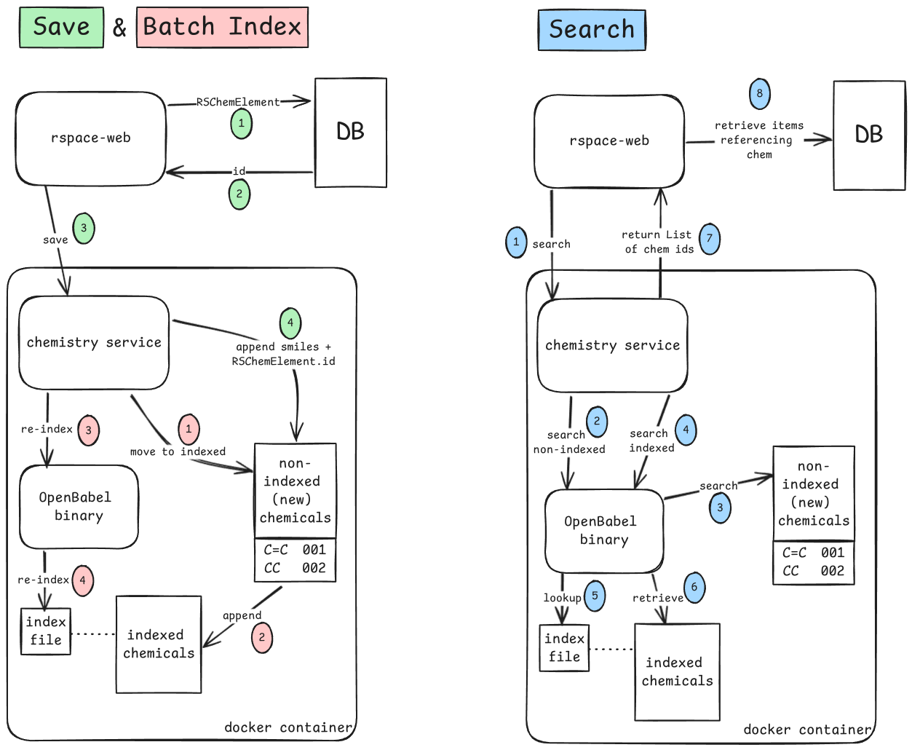

# Chemistry Investigation
POC showing functionality of Indigo and OpenBabel which will be used as part of rspace open-source
chemistry.

Run with `mvn spring-boot:run` from the root of the project.

[Input chemistry files.](src/main/resources/chemical_files/input)

[Output directory.](src/main/resources/chemical_files/output)

## Indigo
The [Indigo](src/main/java/com/researchspace/chemistry_investigation/chemtools/Indigo.java) class:
- renders an image from a chemistry file
- extracts molecule and reaction information from chemistry files
- converts a `.mol` file to `.cdxml`

## OpenBabel

The [OpenBabel](src/main/java/com/researchspace/chemistry_investigation/chemtools/OpenBabel.java) 
class:
- saves chemicals to a 'new' non-indexed file
- periodically 
  - moves chemicals from 'new' file to 'main' indexed file
  - creates a new index file for 'main'
- searches both 'new' non-indexed and 'main' indexed file 

